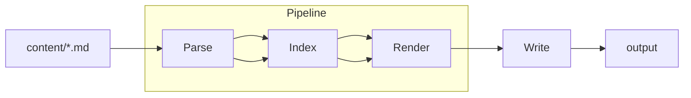

Hello, world!

This is YiiPress preview mode. It rebuilds and reloads automatically when you change files in the `content` or `themes` directories.

Use markdown to format your content. Here is an example:

````markdown
---
title: Hello!
permalink: /
---

My name is Alex. I am a developer so I can do hello world in PHP:

```php
<?php

echo 'Hello, world!';
```

````


