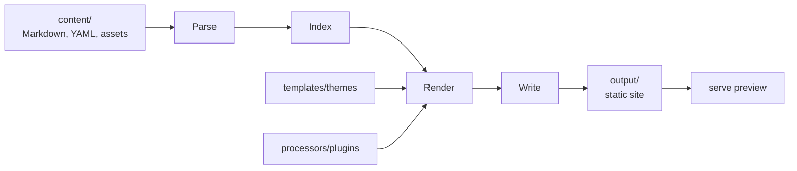
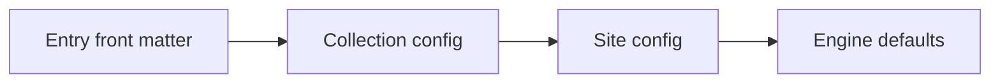
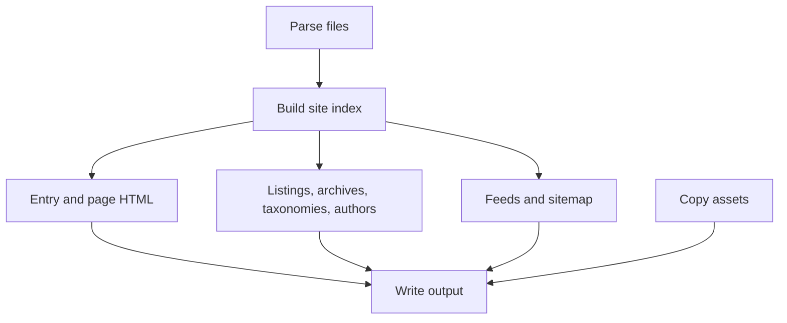

# Architecture

YiiPress is a static website engine with two user-facing modes: build a production-ready static site, and serve a live local preview of that same generated output.

The same pipeline is used by both commands:

- `yiipress build` writes the final static files.
- `yiipress serve` rebuilds the same output directory and serves it with live reload for local preview.

## Content Model

User content lives under `content/`:

- `config.yaml` — site-wide settings.
- `navigation.yaml` — one or more navigation menus.
- `<collection>/_collection.yaml` — collection settings.
- `<collection>/*.md` — entries in a collection.
- `authors/*.md` — author profiles.
- `assets/` and `<collection>/assets/` — copied static files.

YiiPress turns those files into immutable model objects: site config, navigation, collections, entries, authors, taxonomies, and output pages. Entry settings are resolved in this order:

The first configured value wins. For example, an entry `permalink` overrides a collection `permalink`, which overrides the site-wide pattern.

## Build Pipeline

1. **Parse** — read config, collection files, author files, and entry front matter.
2. **Index** — resolve permalinks, apply draft/future filters, sort collections, group taxonomies, build archives, and connect authors.
3. **Render** — convert Markdown to HTML, apply processors, render PHP templates, and produce page objects.
4. **Write** — write `index.html`, feeds, sitemap, redirects, search index, copied assets, and other static files.

## Runtime Modes

### Build

`yiipress build` is the production path. It generates static files and exits. The generated output can be deployed to any static host and does not require PHP in production.

### Serve

`yiipress serve` is the preview path. It serves files from `output/`, injects live reload into HTML responses, and triggers normal builds when content or templates change. Because preview uses the same generated files as production, build and serve output stay aligned.

## Extension Points

- **Templates** control page HTML. See [Templates](templates.md).
- **Content processors** transform Markdown and rendered HTML. See [Plugins](plugins.md).
- **Lifecycle hooks** observe build and render phases for plugin behavior that is not a single content transformation. See [Plugins](plugins.md#lifecycle-hooks).
- **Importers** convert external content sources into Markdown files. See [Importing content](importing-content.md).

Engine-level implementation details, dependency flow, source layout, caching strategy, and performance notes are in [Engine](engine.md).
