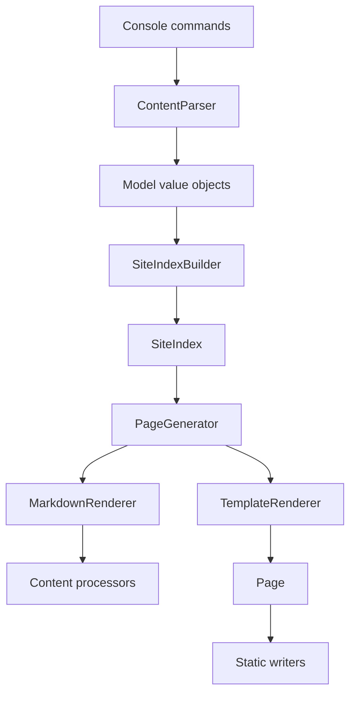
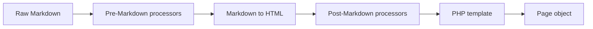

# Engine

This page is for engine developers and advanced contributors. User-facing concepts are covered in [Architecture](architecture.md), [Content](content.md), and [Templates](templates.md).

## Design Principles

- **Static output first** — the production artifact is plain files in `output/`.
- **One pipeline** — build and preview use the same parse, index, render, and write path.
- **Immutable models** — parsed content becomes read-only value objects.
- **Native hot paths** — Markdown, YAML, and syntax highlighting use native extensions where possible.
- **No unnecessary shared state** — parallel workers render independent pages and write independent files.
- **Composition over inheritance** — processors, parsers, importers, and writers are composed through [Yii3 DI](https://yiisoft.github.io/docs/guide/concept/di-container.html).
- **Late body parsing** — front matter is indexed first; Markdown bodies are read and rendered when output needs them.

## Domain Model

The core model consists of immutable value objects:

- **SiteConfig** — parsed `content/config.yaml`.
- **Navigation** — parsed `content/navigation.yaml`.
- **Collection** — parsed `_collection.yaml` plus resolved collection behavior.
- **Entry** — front matter, source location, slug, date, language, permalink, and body offsets.
- **Author** — parsed author file and rendered author metadata.
- **Taxonomy** and **TaxonomyTerm** — taxonomy names, terms, and associated entries.
- **Page** — rendered output URL and HTML content.

Entries resolve metadata in priority order: entry front matter, collection config, site config, then engine defaults. The model layer has no dependency on console, web, renderer, or writer code.

## Dependency Flow



Dependencies point inward: output depends on render, render depends on the index, and the index depends on parsing. Model objects do not depend on renderer, writer, web, or console code.

## Source Layout

```
src/
├── Console/       # build, serve, init, new, import, clean commands
├── Content/       # models, parsers, index, index builder
├── Import/        # importer interfaces and built-in importers
├── Processor/     # Markdown, oEmbed, highlighting, TOC, related content processors
├── Render/        # page generation, Markdown rendering, template rendering
├── Build/         # writers, assets, cache, manifest, themes
├── Web/           # preview server helpers and framework-routed dev actions
└── Environment.php
```

## Parse and Index

Parsing is file-level and stateless. Config and navigation YAML files are small and loaded fully. Entry and author Markdown files are parsed so metadata is available early while body content can be deferred until render time.

Important parser responsibilities:

- **ContentParser** orchestrates all content parsing.
- **FrontMatterParser** reads only bytes up to the closing front matter delimiter, parses YAML with `yaml_parse()`, and leaves body loading for render time.
- **CollectionConfigParser**, **SiteConfigParser**, and **NavigationParser** parse YAML config files.
- **FilenameParser** extracts date and slug from entry filenames.

For memory efficiency, entry and author bodies are loaded on demand. Parser methods yield entries and authors so callers decide whether to stream or collect them.

The index resolves:

- collection membership and explicit collection order;
- permalinks and language prefixes;
- drafts and future-dated entries;
- taxonomy term lookup tables;
- author references;
- archive groups;
- pagination slices.

The index is built once per build and then treated as read-only.

Entries store raw Markdown, not rendered HTML. The index keeps references rather than copies; for example, taxonomy terms reference entry objects instead of duplicating entry data.

The `yiipress new` command normalizes generated entry filenames through `Slugifier`, which keeps Unicode letters in output paths and uses `yiisoft/strings` for UTF-8 casing.

## Rendering

Rendering converts indexed entries and pages into final HTML:



Plain PHP templates are rendered directly with output buffering. There is no compiled intermediate template language.

`PageGenerator` produces page objects for every output URL: entries, standalone pages, listings, taxonomies, authors, archives, feeds, sitemap, redirects, and error pages.

## Content Processors

Content processors implement `ContentProcessorInterface`:

```php
interface ContentProcessorInterface
{
    public function process(string $content, Entry $entry): string;
}
```

`ContentProcessorPipeline` runs processors in sequence. Each processor receives the previous processor's output:

```php
$content = $entry->body();
foreach ($processors as $processor) {
    $content = $processor->process($content, $entry);
}
```

Two pipelines are configured in `config/common/di/content-pipeline.php`:

- **contentPipeline** — used by entry rendering, typically Markdown conversion followed by syntax highlighting and post-processing.
- **feedPipeline** — used by feed generation, usually Markdown conversion without syntax highlighting.

Built-in processors include Markdown conversion through `ext-mdparser`, oEmbed expansion, Mermaid block handling, server-side syntax highlighting, table of contents extraction, and related-content data preparation.

Lifecycle hooks are separate from processors. They expose build-level and final-render PSR-14 events through `yiisoft/yii-event`, so plugins can react to `BuildStartedEvent`, `BuildFinishedEvent`, `RenderStartedEvent`, and `RenderFinishedEvent` without replacing writers or commands.

## Writing

Writers turn page objects and indexed aggregate data into files:

- entry and standalone page `index.html` files;
- collection listings;
- taxonomy indexes and term pages;
- author pages;
- yearly and monthly archives;
- Atom and RSS feeds;
- `sitemap.xml`, `robots.txt`, redirects, and `404.html`;
- copied content and theme assets.

Entry pages and standalone pages can be rendered and written in parallel because each page writes to its own destination path.

Scaffolding commands, cleanup commands, and importer media copying use `yiisoft/files` helpers for consistent filesystem errors and cross-platform directory removal. Build-path directory setup, page writes, output preparation, and bulk asset writer loops keep direct filesystem operations on their hot paths unless benchmarks show a helper abstraction is neutral or faster.

## Performance Model

Performance is handled by doing less work, keeping expensive work native, and letting PHP orchestrate the pipeline:

- YAML front matter uses `yaml_parse()`.
- Markdown uses `ext-mdparser` from `iliaal/mdparser`, backed by bundled MD4C sources.
- Syntax highlighting uses `ext-highlighter`, backed by syntect and Rust.
- Incremental builds reuse the build manifest and content hashes.
- `--workers=auto` detects CPU capacity and caps user-facing defaults to avoid over-forking small builds.
- OPCache can reuse compiled PHP templates when the runtime enables it.
- JIT and preloading remain available to source installs where the PHP runtime is managed directly.

Fork-based parallelism uses `pcntl_fork()`. Each worker receives the indexed site, renders its assigned pages, and writes independent files. Secondary outputs stay sequential or are parallelized only when the page count is high enough to justify worker overhead.

This approach avoids shared memory and synchronization. Feed generation can split work per collection when workers are enabled because feeds may render every entry body again. Sitemap and robots output remain serial.

## Caching

Source installs use `runtime/cache/`. PHAR and static binary runs use a project-scoped cache under the OS temp directory, so packaged commands do not write framework state into the site checkout.

The cache stores:

- parsed front matter keyed by file path and modification time;
- rendered Markdown HTML keyed by content hash;
- incremental build manifests keyed by source and output paths.

Build manifests are treated as disposable cache metadata: missing, unreadable, corrupt, or structurally invalid manifests reset incremental state and trigger normal rebuild work instead of failing the build. Manifest saves write a uniquely named temporary file in the target directory and replace the manifest atomically after the full JSON payload is written.

`yiipress clean` removes both configured output and the relevant build cache.

## Serve Mode

`yiipress serve` runs a ReactPHP preview server over the generated output directory. It validates content and output paths before opening the socket.

The server loop handles:

- static file lookup from `output/`;
- HTML injection for live reload and source-open overlay;
- streamed non-HTML asset responses with backpressure;
- the live reload SSE endpoint with one shared inotify watcher per worker.

The source-open overlay resolves the browser path through the build manifest, verifies the Markdown source stays inside the configured content directory, and launches the configured editor command.

## Theme Registration

Project-local templates under `content/templates/` are registered automatically as the `local` theme. Engine-level or distributable themes are registered in [Yii3 DI](https://yiisoft.github.io/docs/guide/concept/di-container.html):

```php
use YiiPress\Build\Theme;
use YiiPress\Build\ThemeRegistry;
use Yiisoft\Definitions\DynamicReference;

return [
    ThemeRegistry::class => DynamicReference::to(static function (): ThemeRegistry {
        $registry = new ThemeRegistry();
        $registry->register(new Theme('minimal', dirname(__DIR__, 3) . '/themes/minimal'));
        $registry->register(new Theme('fancy', '/path/to/fancy-theme'));

        return $registry;
    }),
];
```

Template resolution checks the active theme first, then falls back through registered themes. This lets a project override one template while keeping the rest of the bundled theme.
