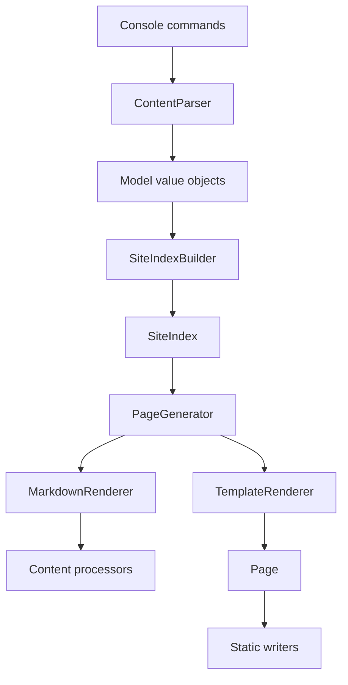
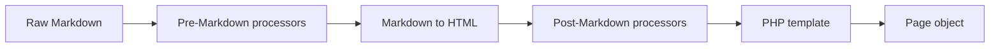

# Engine

This page is for engine developers and advanced contributors. User-facing concepts are covered in [Architecture](architecture.md), [Content](content.md), and [Templates](templates.md).

## Design Principles

- **Static output first** — the production artifact is plain files in `output/`.
- **One pipeline** — build and preview use the same parse, index, render, and write path.
- **Immutable models** — parsed content becomes read-only value objects.
- **Native hot paths** — Markdown, YAML, and syntax highlighting use native extensions where possible.
- **No unnecessary shared state** — parallel workers render independent pages and write independent files.
- **Composition over inheritance** — processors, parsers, importers, and writers are composed through [Yii3 DI](https://yiisoft.github.io/docs/guide/concept/di-container.html).
- **Late body parsing** — front matter is indexed first; Markdown bodies are read and rendered when output needs them.

## Domain Model

The core model consists of immutable value objects:

- **SiteConfig** — parsed `content/config.yaml`.
- **Navigation** — parsed `content/navigation.yaml`.
- **Collection** — parsed `_collection.yaml` plus resolved collection behavior.
- **Entry** — front matter, source location, slug, date, language, permalink, and body offsets.
- **Author** — parsed author file and rendered author metadata.
- **Taxonomy** and **TaxonomyTerm** — taxonomy names, terms, and associated entries.
- **Page** — rendered output URL and HTML content.

Entries resolve metadata in priority order: entry front matter, collection config, site config, then engine defaults. The model layer has no dependency on console, web, renderer, or writer code.

## Dependency Flow


```mermaid
flowchart TD
    commands["Console commands"] --> parser["ContentParser"]
    parser --> model["Model value objects"]
    model --> indexBuilder["SiteIndexBuilder"]
    indexBuilder --> index["SiteIndex"]
    index --> pageGenerator["PageGenerator"]
    pageGenerator --> markdown["MarkdownRenderer"]
    pageGenerator --> templates["TemplateRenderer"]
    markdown --> processors["Content processors"]
    templates --> page["Page"]
    page --> writers["Static writers"]
```

Dependencies point inward: output depends on render, render depends on the index, and the index depends on parsing. Model objects do not depend on renderer, writer, web, or console code.

## Source Layout

```
src/
├── Console/       # build, serve, init, new, import, clean commands
├── Content/       # models, parsers, index, index builder
├── Import/        # importer interfaces and built-in importers
├── Processor/     # Markdown, oEmbed, highlighting, TOC, related content processors
├── Render/        # page generation, Markdown rendering, template rendering
├── Build/         # writers, assets, cache, manifest, themes
├── Web/           # preview server helpers and framework-routed dev actions
└── Environment.php
```

## Parse and Index

Parsing is file-level and stateless. Config and navigation YAML files are small and loaded fully. Entry and author Markdown files are parsed so metadata is available early while body content can be deferred until render time.

Important parser responsibilities:

- **ContentParser** orchestrates all content parsing.
- **FrontMatterParser** reads only bytes up to the closing front matter delimiter, parses YAML with `yaml_parse()`, and leaves body loading for render time.
- **CollectionConfigParser**, **SiteConfigParser**, and **NavigationParser** parse YAML config files.
- **FilenameParser** extracts date and slug from entry filenames.

For memory efficiency, entry and author bodies are loaded on demand. Parser methods yield entries and authors so callers decide whether to stream or collect them.

The index resolves:

- collection membership and explicit collection order;
- permalinks and language prefixes;
- drafts and future-dated entries;
- taxonomy term lookup tables;
- author references;
- archive groups;
- pagination slices.

The index is built once per build and then treated as read-only.

Entries store raw Markdown, not rendered HTML. The index keeps references rather than copies; for example, taxonomy terms reference entry objects instead of duplicating entry data.

The `yiipress new` command normalizes generated entry filenames through `Slugifier`, which keeps Unicode letters in output paths and uses `yiisoft/strings` for UTF-8 casing.

## Rendering

Rendering converts indexed entries and pages into final HTML:


```mermaid
flowchart LR
    body["Raw Markdown"] --> pre["Pre-Markdown processors"]
    pre --> markdown["Markdown to HTML"]
    markdown --> post["Post-Markdown processors"]
    post --> template["PHP template"]
    template --> page["Page object"]
```

Plain PHP templates are rendered directly with output buffering. There is no compiled intermediate template language.

`PageGenerator` produces page objects for every output URL: entries, standalone pages, listings, taxonomies, authors, archives, feeds, sitemap, redirects, and error pages.

## Content Processors

Content processors implement `ContentProcessorInterface`:

```php
interface ContentProcessorInterface
{
    public function process(string $content, Entry $entry): string;
}
```

`ContentProcessorPipeline` runs processors in sequence. Each processor receives the previous processor's output:

```php
$content = $entry->body();
foreach ($processors as $processor) {
    $content = $processor->process($content, $entry);
}
```

Two pipelines are configured in `config/common/di/content-pipeline.php`:

- **contentPipeline** — used by entry rendering, typically Markdown conversion followed by syntax highlighting and post-processing.
- **feedPipeline** — used by feed generation, usually Markdown conversion without syntax highlighting.

Built-in processors include Markdown conversion through `ext-mdparser`, oEmbed expansion, Mermaid block handling, server-side syntax highlighting, table of contents extraction, and related-content data preparation.

Lifecycle hooks are separate from processors. They expose build-level and final-render PSR-14 events through `yiisoft/yii-event`, so plugins can react to `BuildStartedEvent`, `BuildFinishedEvent`, `RenderStartedEvent`, and `RenderFinishedEvent` without replacing writers or commands.

## Writing

Writers turn page objects and indexed aggregate data into files:

- entry and standalone page `index.html` files;
- collection listings;
- taxonomy indexes and term pages;
- author pages;
- yearly and monthly archives;
- Atom and RSS feeds;
- `sitemap.xml`, `robots.txt`, redirects, and `404.html`;
- copied content and theme assets.

Entry pages and standalone pages can be rendered and written in parallel because each page writes to its own destination path. Each entry worker prepares the directories needed by its own task chunk before rendering, so directory creation overlaps across workers instead of delaying every worker behind a parent-process setup pass. Shared output directories tolerate concurrent creation; failures still abort the build. No-write builds do not create these directories.

Scaffolding commands, cleanup commands, and importer media copying use `yiisoft/files` helpers for consistent filesystem errors and cross-platform directory removal. Build-path directory setup, page writes, output preparation, and bulk asset writer loops keep direct filesystem operations on their hot paths unless benchmarks show a helper abstraction is neutral or faster. Full-build replacement cleanup uses native directory traversal through `DirectoryRemover`; directory symlinks are removed as links, preserving their targets. Asset URL rewriting reuses a literal path-search pattern cached by the fingerprint manifest, invalidates it on registration, and falls back to substring searches if PCRE cannot handle the pattern.

## Performance Model

Performance is handled by doing less work, keeping expensive work native, and letting PHP orchestrate the pipeline:

- YAML front matter uses `yaml_parse()`.
- Markdown uses `ext-mdparser` from `iliaal/mdparser`, backed by bundled MD4C sources.
- Syntax highlighting uses `ext-highlighter`, backed by syntect and Rust.
- Incremental builds reuse the build manifest and content hashes. Unchanged builds validate tracked directories, sources, and output existence before returning; they skip collecting a replacement directory inventory. Source checks hash file contents, so same-size edits with unchanged timestamps are detected. Directory checks include entry names, so rapid additions are detected even when directory timestamps match. Asset discovery filters content extensions before file type checks.
- `--workers=auto` detects CPU capacity and caps user-facing defaults to avoid spawning too many workers for small builds.
- OPCache can reuse compiled PHP templates when the runtime enables it.
- JIT and preloading remain available to source installs where the PHP runtime is managed directly.

Parallel builds spawn independent worker processes (`proc_open()`) rather than forking. Forked workers would inherit the running PHAR's file descriptor and its shared read offset, so two workers autoloading a class for the first time at once could race on that offset and corrupt the decompression (a phar crc32 mismatch, or a class body full of another file's bytes); independent processes each get their own file descriptor, so there is nothing to race on. This holds on every platform, not just Windows. The internal `worker` command used for these child processes remains executable but is hidden from the user-facing command list. Each worker receives an isolated typed rendering job — the indexed site, its assigned pages, and enough context to reconstruct its own processor pipeline and theme registry — renders them, and writes independent files. Listing and archive batches stay sequential below 256 tasks; above that, the task runner allows one worker per 128 tasks, capped by the requested worker count. This threshold amortizes independent-process startup and serialization costs; it is a heuristic, and unusually expensive custom templates may have a different crossover point.

This approach avoids shared memory and synchronization, at the cost of each worker re-bootstrapping its own pipeline rather than inheriting one already built in the parent. Feed generation stays sequential when fewer than 1,000 entries will be included across collection feeds. At or above that threshold, work can split per collection, capped by the requested worker count. The count respects each collection's feed limit; unlimited feeds count every entry. This is a measured heuristic for the default pipeline, and expensive custom processors may have a different crossover point. Limited collection feeds send only the selected entries to workers; the complete collection remains available for site-wide feeds and other outputs. Sitemap and robots output remain serial.

## Quality Tooling

Development and CI commands run in Docker through `make`:

- `make test`, `make phpstan`, and `make composer-dependency-analyser` validate behavior and static correctness;
- `make infection` mutation-tests all covered production code, enforces the current 70% covered-code MSI baseline, and publishes its mutation score on `master`;
- `make bench` records aggregate results together with environment information.

CI workflows use path filters and concurrency cancellation to avoid obsolete or unrelated runs. Pull requests compare PHPBench results with `master`, and same-repository branches receive automatic Rector and PHP CS Fixer commits. Infection enforces a 70% covered-code mutation score and publishes the `master` mutation score to Stryker Dashboard when the `STRYKER_DASHBOARD_API_KEY` repository secret is configured. Dependabot maintains Composer and pinned GitHub Actions dependencies, while Zizmor checks workflow changes for security issues. PHPStan runs at max level without a baseline, so every finding fails CI.

## Caching

Source installs use `runtime/cache/`. PHAR and static binary runs use a project-scoped cache under the OS temp directory, so packaged commands do not write framework state into the site checkout.

The cache stores:

- rendered entry HTML keyed by source content, templates, and rendering context;
- incremental build manifests keyed by source and output paths;
- shared-output dependency fingerprints and the output paths they own.

Build manifests are treated as disposable cache metadata: missing, unreadable, corrupt, or structurally invalid manifests reset incremental state and trigger normal rebuild work instead of failing the build. Manifest saves write a uniquely named temporary file in the target directory and replace the manifest atomically after the full JSON payload is written.

Shared outputs use per-output dependency fingerprints: listing and taxonomy pages track their selected entries and pagination; date archives track their groups; author pages track profiles and entries; feeds track only entries within their configured limit. Sitemap dependencies track URLs and dates, so a body-only edit can leave it untouched. Global dependencies include configuration, navigation, authors, asset fingerprints, and the cross-reference map. Filtering happens before worker dispatch.

The output inventory removes obsolete listing, archive, taxonomy, author, feed, and sitemap files, while preserving paths newly owned by entries or assets. Missing output files trigger regeneration. Changed build flags and configuration inventories invalidate reuse. Future publication deadlines use the same time as content filtering and prevent the next build from returning early after a deadline passes. Author profiles are tracked as configuration dependencies.

Custom templates and project processors can read arbitrary other content, so builds with them conservatively regenerate entries and shared outputs whenever a rebuild is needed. Entry dependencies involving related posts, multiple languages, navigation pagers, or changed cross-reference targets also force entry regeneration. This preserves the same build pipeline for production and live preview.

Shared-output metadata is invalidated before writing and saved atomically only after a successful build. Missing or corrupt metadata for an existing managed output triggers a full replacement, which also removes outputs whose ownership can no longer be recovered. `--no-cache` invalidates this metadata without building a replacement inventory; the next normal build reconstructs it. Source hashes verified during the build are reused for manifest recording and shared-output keys. These checks cost more than timestamp-only unchanged-build detection; see [the measurements](benchmarking.md#selective-shared-output-regeneration-september-2026).

`yiipress clean` removes both configured output and the relevant build cache.

## Serve Mode

`yiipress serve` runs a ReactPHP preview server over the generated output directory. It validates content and output paths before opening the socket.

The server loop handles:

- static file lookup from `output/`;
- HTML injection for live reload and source-open overlay;
- streamed non-HTML asset responses with backpressure;
- the live reload SSE endpoint with one shared inotify watcher per worker.

The source-open overlay resolves the browser path through the build manifest, verifies the Markdown source stays inside the configured content directory, and launches the configured editor command.

## Theme Registration

Project themes under `<project>/themes/<name>/` are registered automatically by directory name. Project-local templates under `content/templates/` are registered automatically as the `local` theme. Engine-level themes may still be registered in [Yii3 DI](https://yiisoft.github.io/docs/guide/concept/di-container.html):

```php
use YiiPress\Build\Theme;
use YiiPress\Build\ThemeRegistry;
use Yiisoft\Definitions\DynamicReference;

return [
    ThemeRegistry::class => DynamicReference::to(static function (): ThemeRegistry {
        $registry = new ThemeRegistry();
        $registry->register(new Theme('minimal', dirname(__DIR__, 3) . '/themes/minimal'));

        return $registry;
    }),
];
```

For binary users, install a reusable theme as `themes/fancy/` and set `theme: fancy` in `content/config.yaml`. Template resolution checks the active theme first, then falls back through registered themes. This lets a project override one template while keeping the rest of the bundled theme. Theme assets are copied under `assets/themes/<theme>/`, and templates should use `$themeAsset('file.css')` so installed themes do not overwrite each other's files.
