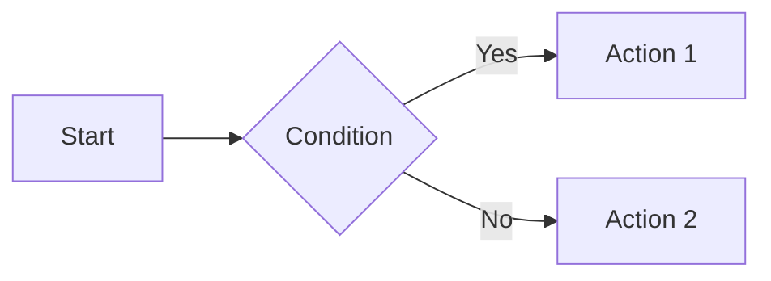
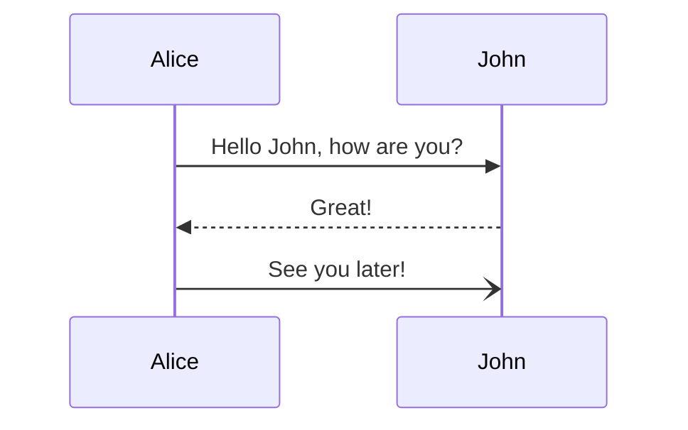
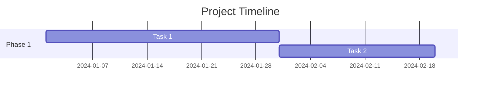

# Content processors

Content processors transform entry content through a pipeline. Each processor receives the output of the previous one.

## Processor interface

A processor implements `App\Processor\ContentProcessorInterface`:

```php
interface ContentProcessorInterface
{
    public function process(string $content, Entry $entry): string;
}
```

## Content processor pipeline

`ContentProcessorPipeline` chains processors in order:

```
markdown → MarkdownProcessor → SyntaxHighlightProcessor → ... → final HTML
```

Two separate pipelines are configured via Yii3 DI container in `config/common/di/content-pipeline.php`:

- **contentPipeline** — used by `EntryRenderer`: `MarkdownProcessor` → `SyntaxHighlightProcessor`
- **feedPipeline** — used by `FeedGenerator`: `MarkdownProcessor` only (no syntax highlighting in feeds)

## Built-in processors

### MarkdownProcessor

Converts markdown to HTML using md4c. Accepts `MarkdownConfig` via constructor for feature toggles (tables, strikethrough, tasklists, etc.).

### SyntaxHighlightProcessor

Highlights code blocks server-side during build. No client-side JavaScript is needed.

Use standard fenced code blocks with a language identifier:

````markdown
```php
echo "Hello, world!";
```
````

The highlighter is a Rust library (`src/Highlighter/`) built with [syntect](https://github.com/trishume/syntect)
and [rayon](https://github.com/rayon-rs/rayon), called from PHP via FFI. It processes all
`<pre><code class="language-xxx">` blocks in the rendered HTML, replacing them with
inline-styled highlighted output.

Rayon parallelizes highlighting across code blocks within a single page, which helps
when a page contains many code blocks (e.g., documentation pages).

The library is compiled during Docker image build (multistage build) and installed as
`/usr/local/lib/libyiipress_highlighter.so`. No additional setup is needed.

Supported languages include all syntect defaults (PHP, JavaScript, Python, Rust, YAML,
Bash, SQL, HTML, CSS, and many more). Code blocks with an unrecognized language are
highlighted as plain text.

### MermaidProcessor

Renders [Mermaid](https://mermaid.js.org/) diagrams on the client side.

Use fenced code blocks with `mermaid` language identifier:

**Flowchart:**
````markdown

````

**Sequence diagram:**
````markdown

````

**Gantt chart:**
````markdown

````

The processor converts the code block to a `<div class="mermaid">` element.
Mermaid.js (loaded via CDN in the template) renders the diagram as SVG in the browser.

Supported diagram types: flowcharts, sequence diagrams, Gantt charts, pie charts, class diagrams, state diagrams, user journey maps, and more.

**Note:** Mermaid.js is only loaded on pages that contain diagrams to reduce bandwidth.

For full syntax reference, see [Mermaid documentation](https://mermaid.js.org/intro/).

## Writing a custom processor

Create a class implementing `ContentProcessorInterface`. For example, a shortcode processor:

```php
final class ShortcodeProcessor implements ContentProcessorInterface
{
    public function process(string $content, Entry $entry): string
    {
        return preg_replace(
            '/\[youtube id="([^"]+)"\/\]/',
            '<div class="video"><iframe src="https://www.youtube.com/embed/$1"></iframe></div>',
            $content,
        );
    }
}
```

To register it, add it to `config/common/di/content-pipeline.php`. Place it before `MarkdownProcessor` since it operates on markdown:

```php
return [
    ContentProcessorPipeline::class => [
        '__construct()' => [
            new ShortcodeProcessor(),
            new MarkdownProcessor(),
            new SyntaxHighlightProcessor(),
        ],
    ],
];
```

Processor order matters — each processor receives the output of the previous one.

# Content importers

Content importers convert data from external sources (Telegram, WordPress, Jekyll, REST APIs, databases, etc.) into YiiPress markdown files with front matter. They are invoked via the `yii import` command.

## Importer interface

An importer implements `App\Import\ContentImporterInterface`:

```php
interface ContentImporterInterface
{
    public function options(): array;
    public function import(array $options, string $targetDirectory, string $collection): ImportResult;
    public function name(): string;
}
```

- **`options()`** — returns a list of `ImporterOption` objects declaring what CLI options this importer accepts. Each option becomes a `--name` flag in the `yii import` command.
- **`import()`** — receives resolved option values as `$options` (keyed by option name), creates `.md` files in `$targetDirectory/$collection/`, copies media to `$targetDirectory/$collection/assets/`, and creates `_collection.yaml` if missing.
- **`name()`** — returns the unique identifier used as the `source` argument in `yii import` (e.g., `telegram`, `wordpress`).

### ImporterOption

Each importer declares its options using `ImporterOption`:

```php
new ImporterOption(
    name: 'directory',
    description: 'Path to the export directory',
    required: true,
    default: null,
)
```

- **`name`** — option name, used as `--name` on the CLI and as key in the `$options` array.
- **`description`** — help text shown in `yii import --help`.
- **`required`** — whether the option must be provided. The command validates this before calling `import()`.
- **`default`** — default value when the option is not provided (only for optional options).

### ImportResult

`ImportResult` is a value object returned by `import()` containing:

- **`totalMessages()`** — total number of source items found.
- **`importedCount()`** — number of items successfully imported.
- **`importedFiles()`** — list of created file paths.
- **`skippedFiles()`** — list of skipped items with reasons.
- **`warnings()`** — list of warning messages.

## Built-in importers

### TelegramContentImporter

Imports messages from a Telegram Desktop channel export (JSON format). Declares a single required `--directory` option. See [commands.md](commands.md#yii-import) for usage details.

## Writing a custom importer

Create a class implementing `ContentImporterInterface`. Each importer declares its own options — a file-based importer might need a `directory`, while an API-based importer might need `url` and `api-key`.

For example, a REST API importer:

```php
final class RestApiContentImporter implements ContentImporterInterface
{
    public function options(): array
    {
        return [
            new ImporterOption(name: 'url', description: 'API endpoint URL', required: true),
            new ImporterOption(name: 'api-key', description: 'API authentication key', required: true),
            new ImporterOption(name: 'limit', description: 'Max posts to import', default: '100'),
        ];
    }

    public function import(array $options, string $targetDirectory, string $collection): ImportResult
    {
        $url = $options['url'];
        $apiKey = $options['api-key'];
        $limit = (int) ($options['limit'] ?? '100');

        // 1. Fetch data from the API
        // 2. For each post, create a .md file with front matter in $targetDirectory/$collection/
        // 3. Return ImportResult with stats
    }

    public function name(): string
    {
        return 'rest-api';
    }
}
```

Each generated markdown file should follow the standard YiiPress front matter format:

```markdown
---
title: My Post Title
date: 2024-03-15 10:30:00
tags:
  - php
  - tutorial
---

Post content in markdown...
```

To register the importer, add it to the `importers` array in `config/common/di/importer.php`:

```php
use App\Console\ImportCommand;
use App\Import\TelegramContentImporter;
use App\Import\RestApiContentImporter;

return [
    ImportCommand::class => [
        '__construct()' => [
            'rootPath' => dirname(__DIR__, 3),
            'importers' => [
                'telegram' => new TelegramContentImporter(),
                'rest-api' => new RestApiContentImporter(),
            ],
        ],
    ],
];
```

The array key must match the value returned by `name()` and is used as the `source` argument:

```bash
yii import rest-api --url=https://api.example.com/posts --api-key=secret
```
