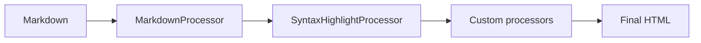
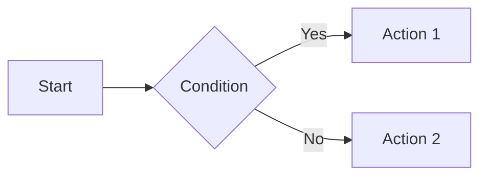
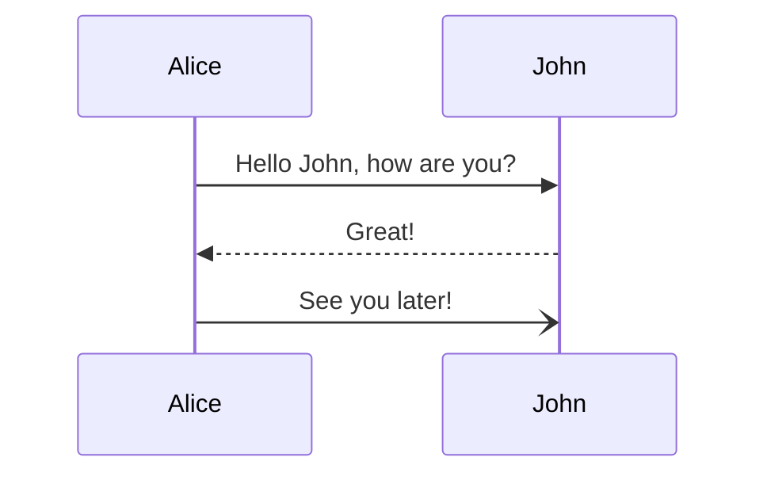
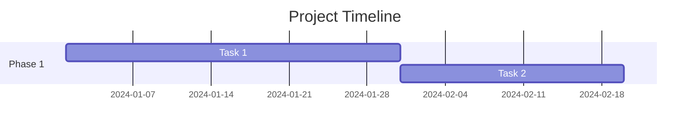

# Plugins

YiiPress extension points are configured through [Yii3 DI](https://yiisoft.github.io/docs/guide/concept/di-container.html). Content processors transform Markdown and rendered HTML during builds; related-content and table-of-contents processors add shared page behavior.

Lifecycle hooks cover build-wide and render-wide plugin behavior that is outside a single content processor.

## Content processors

Content processors transform entry content through a pipeline. Each processor receives the output of the previous one.

### Processor interface

A processor implements `YiiPress\Processor\ContentProcessorInterface`:

```php
interface ContentProcessorInterface
{
    public function process(string $content, Entry $entry): string;
}
```

### Content processor pipeline

`ContentProcessorPipeline` chains processors in order:


```mermaid
flowchart LR
    markdown["Markdown"] --> markdownProcessor["MarkdownProcessor"]
    markdownProcessor --> syntax["SyntaxHighlightProcessor"]
    syntax --> custom["Custom processors"]
    custom --> html["Final HTML"]
```

Two separate pipelines are configured via the [Yii3 DI container](https://yiisoft.github.io/docs/guide/concept/di-container.html) in `config/common/di/content-pipeline.php`:

- **contentPipeline** — used by `EntryRenderer`: `MarkdownProcessor` → `SyntaxHighlightProcessor`
- **feedPipeline** — used by `FeedGenerator`: `MarkdownProcessor` only (no syntax highlighting in feeds)

## Built-in processors

### MarkdownProcessor

Converts Markdown to HTML using md4c. Accepts `MarkdownConfig` via constructor for feature toggles 
(tables, strikethrough, tasklists, etc.).

### SyntaxHighlightProcessor

Highlights code blocks server-side during build. No client-side JavaScript is needed.

Use standard fenced code blocks with a language identifier:

````markdown
```php
echo "Hello, world!";
```
````

The highlighter is a reusable native PHP extension package, `yiipress/highlighter`. The extension
defines the PHP API as `YiiPress\Highlighter`, builds a Rust
library with [syntect](https://github.com/trishume/syntect) and [rayon](https://github.com/rayon-rs/rayon),
then statically links that library into `ext-highlighter`. It processes all
`<pre><code class="language-xxx">` blocks in the rendered HTML, replacing them with
inline-styled highlighted output.

The bundled `minimal` theme adds a client-side **Copy** button to rendered code blocks.

The native extension passes explicit input and output lengths so repeated highlighting calls avoid
extra C-string scans at the PHP/Rust boundary.

Rayon parallelizes highlighting across code blocks within a single page, which helps
when a page contains many code blocks (e.g., documentation pages).

The extension is downloaded from Packagist during Docker image build, compiled, and enabled as `ext-highlighter`.
No additional setup is needed in the YiiPress Docker images. Outside Docker, install the extension
with PIE:

```bash
pie install yiipress/highlighter
```

Use it directly from PHP:

```php
use YiiPress\Highlighter;

$html = (new Highlighter())->highlightHtml($html, 'Solarized (dark)');
```

Highlight raw code without wrapping it in `<pre><code>` first:

```php
$html = (new Highlighter())->highlight('echo "Hello";', 'php');
```

Use `class_exists(Highlighter::class)` to detect whether the extension is loaded.

Supported languages include all syntect defaults (PHP, JavaScript, Python, Rust, YAML,
Bash, SQL, HTML, CSS, and many more). Code blocks with an unrecognized language are
highlighted as plain text.

The highlighting color scheme is configured site-wide in `content/config.yaml` via
`highlight_theme`. If omitted, YiiPress uses syntect's `InspiredGitHub` theme.

### MermaidProcessor

Renders [Mermaid](https://mermaid.js.org/) diagrams on the client side.

Use fenced code blocks with `mermaid` language identifier:

**Flowchart:**
````markdown

```mermaid
flowchart LR
    A[Start] --> B{Condition}
    B -->|Yes| C[Action 1]
    B -->|No| D[Action 2]
```
````

**Sequence diagram:**
````markdown

```mermaid
sequenceDiagram
    Alice->>John: Hello John, how are you?
    John-->>Alice: Great!
    Alice-)John: See you later!
```
````

**Gantt chart:**
````markdown

```mermaid
gantt
    title Project Timeline
    dateFormat  YYYY-MM-DD
    section Phase 1
    Task 1 :a1, 2024-01-01, 30d
    Task 2 :after a1, 20d
```
````

The processor converts the code block to a `<div class="mermaid">` element.
Mermaid.js (loaded via CDN in the template) renders the diagram as SVG in the browser.

Supported diagram types: flowcharts, sequence diagrams, Gantt charts, pie charts, class diagrams, state diagrams, 
user journey maps, and more.

**Note:** Mermaid.js is only loaded on pages that contain diagrams to reduce bandwidth.

For full syntax reference, see [Mermaid documentation](https://mermaid.js.org/intro/).

### YouTubeProcessor

Expands YouTube shortcodes into responsive embed HTML before markdown processing.

```markdown
[youtube id="dQw4w9WgXcQ" /]
```

Optional start time (in seconds):

```markdown
[youtube id="dQw4w9WgXcQ" start="30" /]
```

With custom dimensions:

```markdown
[youtube id="dQw4w9WgXcQ" width="640" height="360" /]
```

Generated HTML includes:
- Responsive iframe container with `.video-container` wrapper
- Lazy loading (`loading="lazy"`)
- Fullscreen support (`allowfullscreen`)
- Accessible title attribute
- CSS classes: `.shortcode`, `.shortcode-youtube`

### VimeoProcessor

Expands Vimeo shortcodes into responsive embed HTML before markdown processing.

```markdown
[vimeo id="123456789" /]
```

With custom dimensions:

```markdown
[vimeo id="123456789" width="640" height="360" /]
```

Generated HTML includes:
- Responsive iframe container with `.video-container` wrapper
- Privacy-friendly embed (`dnt=1` - do not track)
- Lazy loading (`loading="lazy"`)
- Fullscreen support (`allowfullscreen`)
- Accessible title attribute
- CSS classes: `.shortcode`, `.shortcode-vimeo`

Both shortcode processors support:
- Self-closing (`/]`) and regular syntax
- Double quotes, single quotes, or no quotes for attribute values (no spaces)
- Case-insensitive shortcode names

### TweetProcessor

Expands tweet shortcodes into Twitter embed HTML before markdown processing.
The Twitter widget JS is injected into `<head>` only on pages that contain tweet embeds.

```markdown
[tweet id="1234567890" /]
```

Generated HTML includes:
- A `<blockquote class="twitter-tweet">` element with a link to the tweet
- Privacy-friendly embed (`data-dnt="true"` — do not track)
- CSS classes: `.shortcode`, `.shortcode-tweet`
- The Twitter widget script (`platform.twitter.com/widgets.js`) injected once per page

### OEmbedProcessor

Expands standalone provider URLs into embed HTML before markdown processing.

Providers are pluggable. Each provider implements `YiiPress\Processor\OEmbed\OEmbedInterface` and owns both:
- URL matching logic
- the generated embed HTML

```php
interface OEmbedInterface
{
    public function supportsOEmbed(string $url): bool;

    public function replaceOEmbed(string $url): ?string;
}
```

The built-in shortcode processors implement `OEmbedInterface` directly, so each provider owns its shortcode parsing,
standalone URL matching, and generated HTML in one class.

Register providers through `OEmbedProcessor` in `config/common/di/content-pipeline.php`:

```php
OEmbedProcessor::class => [
    'class' => OEmbedProcessor::class,
    '__construct()' => [
        Reference::to(YouTubeProcessor::class),
        Reference::to(VimeoProcessor::class),
        Reference::to(TweetProcessor::class),
    ],
],
```

Supported providers:
- YouTube watch URLs (`https://www.youtube.com/watch?v=...`)
- YouTube short URLs (`https://youtu.be/...`)
- Vimeo video URLs (`https://vimeo.com/123456789`)
- Twitter/X status URLs (`https://twitter.com/.../status/...`, `https://x.com/.../status/...`)

Example:

```markdown
https://www.youtube.com/watch?v=dQw4w9WgXcQ

https://vimeo.com/123456789

https://x.com/OpenAI/status/1234567890
```

Each URL must appear on its own line. Inline links remain unchanged.

Generated HTML uses the same wrappers and classes as the built-in shortcode processors:
- `.shortcode-youtube`
- `.shortcode-vimeo`
- `.shortcode-tweet`

For tweet/status embeds, the existing Twitter widget script is injected automatically because the generated
HTML matches the same marker format as `TweetProcessor`.

### Related content

Suggests other entries that share tags and categories with the current one. When enabled,
an in-memory `RelatedIndex` is built once per build from all indexed entries and injects a
`$related` variable into entry templates — a list of `YiiPress\Content\Model\RelatedEntry`
objects ordered by relevance.

Each related entry exposes:
- `title` — source entry title
- `permalink` — resolved URL
- `date` — `DateTimeImmutable|null`
- `summary` — entry summary (front matter or auto-generated)
- `score` — relevance score (shared tags × `tag_weight` + shared categories × `category_weight`)

Enable in `content/config.yaml` (disabled by default):

```yaml
related: true
```

Or configure:

```yaml
related:
  limit: 5                     # maximum number of related entries per page (default: 5)
  tag_weight: 2                # score per shared tag (default: 2)
  category_weight: 3           # score per shared category (default: 3)
  same_collection_only: true   # only suggest entries from the same collection (default: true)
```

Scoring uses an inverted term → entry index, so building the full related graph runs in
time proportional to the number of term postings rather than O(N²).

Templates can render it:

```php
<?php if (!empty($related)): ?>
<section class="related">
    <h2><?= htmlspecialchars($t('related_posts')) ?></h2>
    <ul>
        <?php foreach ($related as $item): ?>
        <li><a href="<?= htmlspecialchars($item->permalink) ?>"><?= htmlspecialchars($item->title) ?></a></li>
        <?php endforeach; ?>
    </ul>
</section>
<?php endif; ?>
```

The bundled `minimal` theme renders a localized related-posts section automatically when the
feature is enabled.

### TocProcessor

Generates a table of contents from headings in the rendered HTML.

Enabled by default. Disable globally in `content/config.yaml`:

```yaml
toc: false
```

When enabled, the processor:
- Injects `id` attributes into all heading tags (`<h1>`–`<h6>`), slugified from the heading text
- Renders a hover permalink anchor inside each heading
- Deduplicates IDs by appending a numeric suffix (`intro`, `intro-2`, `intro-3`)
- Keeps existing heading `id` attributes unchanged
- Passes a `$toc` variable to entry templates — a list of `{id, text, level}` entries

Templates can render the TOC as a navigation list:

```php
<?php if ($toc !== []): ?>
<nav class="toc">
    <ol>
        <?php foreach ($toc as $item): ?>
        <li class="toc-level-<?= $item['level'] ?>">
            <a href="#<?= htmlspecialchars($item['id']) ?>"><?= htmlspecialchars($item['text']) ?></a>
        </li>
        <?php endforeach; ?>
    </ol>
</nav>
<?php endif; ?>
```

## Writing a custom processor

Create a class implementing `ContentProcessorInterface`. For example, a shortcode processor:

```php
final class ShortcodeProcessor implements ContentProcessorInterface
{
    public function process(string $content, Entry $entry): string
    {
        return preg_replace(
            '/\[youtube id="([^"]+)"\/\]/',
            '<div class="video"><iframe src="https://www.youtube.com/embed/$1"></iframe></div>',
            $content,
        );
    }
}
```

To register it, add it to `config/common/di/content-pipeline.php`. Place it before `MarkdownProcessor` since it operates on markdown:

```php
return [
    ContentProcessorPipeline::class => [
        '__construct()' => [
            new ShortcodeProcessor(),
            new MarkdownProcessor(),
            new SyntaxHighlightProcessor(),
        ],
    ],
];
```

Processor order matters — each processor receives the output of the previous one.

## Lifecycle hooks

Lifecycle hooks use PSR-14 events through `yiisoft/yii-event` and `yiisoft/event-dispatcher`. They are intended for plugin behavior that needs build lifecycle context, final page HTML, or build-wide side effects.

Available events:

- `BuildStartedEvent` — fired after site config, navigation, collections, and authors are parsed, before entries and support files are written
- `BuildFinishedEvent` — fired after a successful build, once entries, support files, assets, sitemap, search index, taxonomies, and author pages are generated
- `RenderStartedEvent` — fired before an entry or standalone page render starts
- `RenderFinishedEvent` — fired after final page HTML is rendered; listeners may replace the HTML via `setHtml()`

Register listeners in the Yii event configuration group:

```php
// config/common/events.php
use YiiPress\Hook\BuildFinishedEvent;
use YiiPress\Hook\RenderFinishedEvent;

return [
    RenderFinishedEvent::class => [
        static function (RenderFinishedEvent $event): void {
            $event->setHtml(str_replace('</body>', '<!-- generated by plugin --></body>', $event->html()));
        },
    ],
    BuildFinishedEvent::class => [
        static function (BuildFinishedEvent $event): void {
            file_put_contents($event->context->outputDir . '/plugin.txt', 'done');
        },
    ],
];
```

Then include that file in `config/configuration.php`:

```php
'events' => 'common/events.php',
```

`BuildContext` exposes `rootPath`, `contentDir`, `outputDir`, worker count, draft/future flags, and build mode flags. Render events expose the current `SiteConfig`, `Entry`, and permalink.

`BuildFinishedEvent` is a successful-build event. If the build throws before completion, YiiPress does not dispatch it.

Render events are dispatched in the process that renders the entry. With multiple workers, this is a forked worker process. `RenderFinishedEvent::setHtml()` works in parallel builds because the worker writes the returned HTML, but listener-owned in-memory aggregation such as counters, collected permalinks, or object mutations is not visible in the parent process. Use build-level events, external storage, or a single worker for aggregation that must survive the whole build.

When no event dispatcher is injected, hooks use a fast null path and do not allocate per-render event objects. In the default YiiPress app configuration, `yiisoft/yii-event` provides the dispatcher and empty listener collection.
